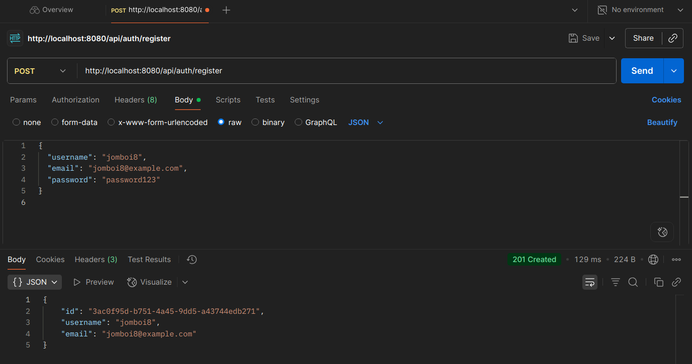
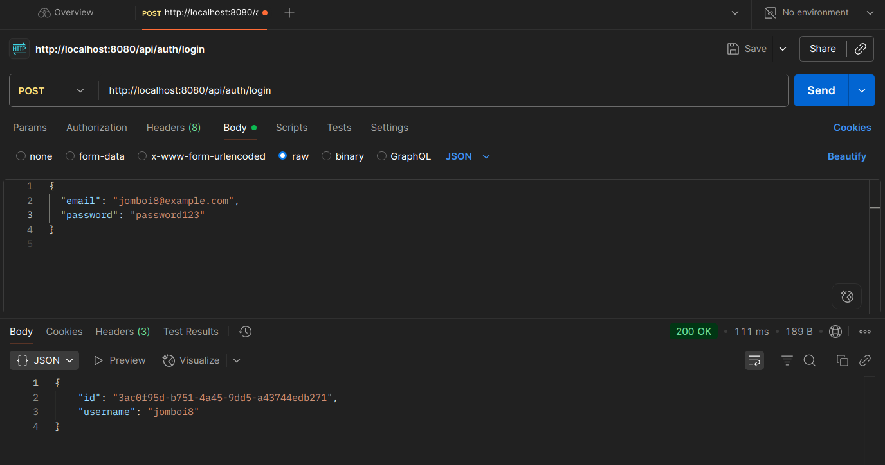
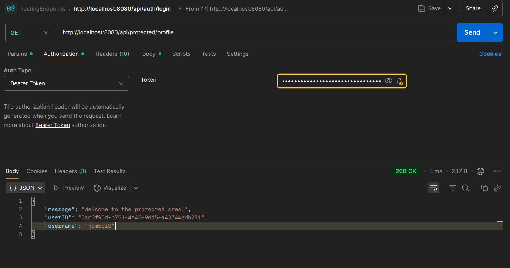

# KairoAPI

**KairoAPI** is a modular, extensible project management API built in Go. It includes full authentication, task and project management and a scalable architecture to support future features like idea capture, collaboration and planning flows.

This is more than a basic task manager. KairoAPI is designed as a backend foundation for building real-world tools like productivity apps, knowledge systems and team project platforms.

---

## Features
### Authentication Demos
 `/auth/register`  Register a new user  
  
 ---        
 `/auth/login`     Login and get token 
 
 ---
 `Protected route` api/protected/profile
 
 ---
- User authentication with JWT (register, login
- Project and task management (CRUD operations)
- Task status tracking (Todo, In Progress, Done)
- Clean architecture (handlers, services, repositories)
- PostgreSQL database with Docker support
- Easily extendable for teams, labels, comments and ideas

---

## Tech Stack

- **Language:** Go
- **Database:** PostgreSQL
- **Auth:** JWT (with bcrypt password hashing)
- **Architecture:** Modular + clean architecture principles
- **Containerization:** Docker, Docker Compose


## Getting Started

### Prerequisites

- Go 1.21+
- Docker + Docker Compose

### Clone and Run

```bash
git clone https://github.com/lenardjombo/kairoapi.git 
cd kairoapi
cp .env.example .env
docker-compose up --build
```

API will be running at: ```http://localhost:8080```

### Environment Configuration

Update your .env file:

```
DB_HOST=localhost
DB_PORT=5432
DB_USER=postgres
DB_PASSWORD=yourpassword
DB_NAME=kairodb
```

JWT_SECRET=your_secret_key

Example API Routes
| Endpoint         | Method | Description          | Auth Required |
| ---------------- | ------ | -------------------- | ------------- |
| `/auth/register` | POST   | Register a new user  | No            |
| `/auth/login`    | POST   | Login and get token  | No            |
| `/projects`      | GET    | List all projects    | Yes           |
| `/projects/:id`  | GET    | Get a single project | Yes           |
| `/tasks`         | POST   | Create a new task    | Yes           |
| `/tasks/:id`     | PATCH  | Update task status   | Yes           |


License

This project is licensed under the MIT License.


---


